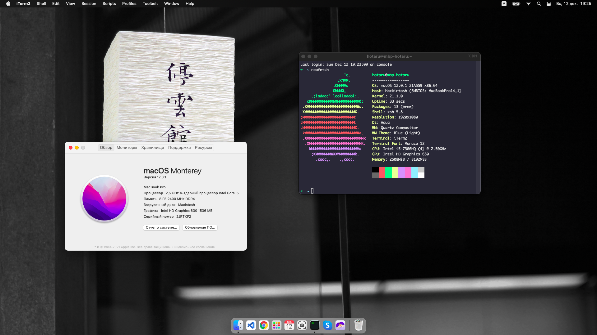
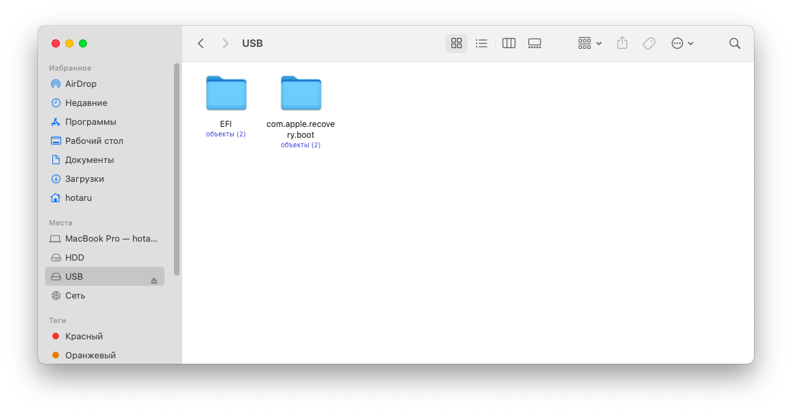
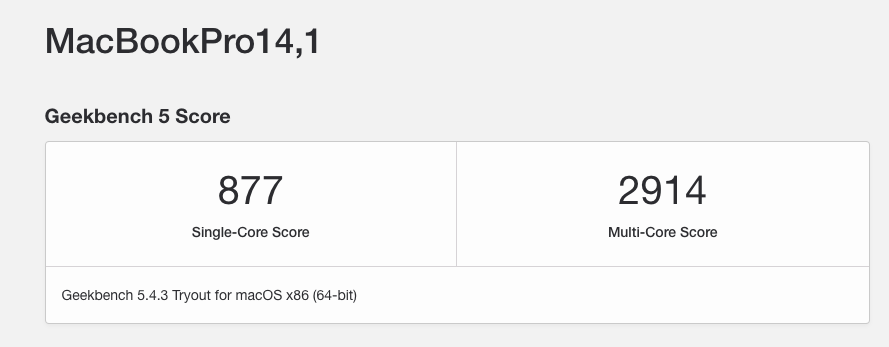
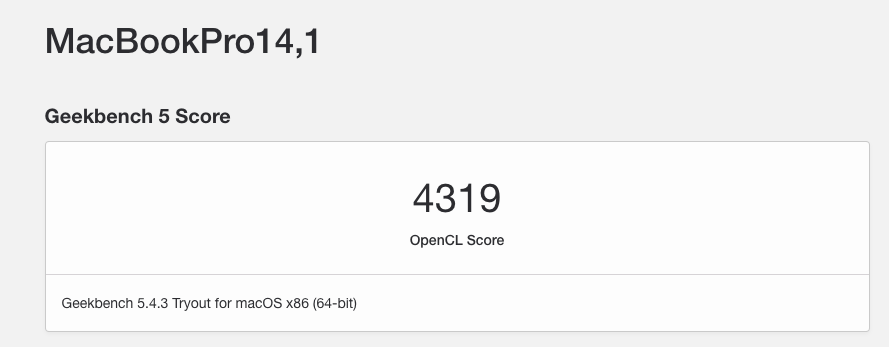

# Warning!!!

This repository is being archived! I have no time to maintain hackintosh and I no longer use it.

<p align="center">
	
</p>

<h1>Hackintosh OpenCore Dell Inspiron 15 Gaming 7567</h1>



## What works

Everything except the card reader and HDMI output.

## What works partially

~~Bluetooth works, but might be buggy and glitchy, buy some USB Bluetooth adapters as they are pretty cheap (only 3~4$), I'm using the Buro BU-BT21A adapter which works out of the box.~~ 

With the latest itlwm.kext update, Bluetooth works without any issues out of the box.

## Creating USB installer
Format your USB flash drive as FAT32. Download the latest [OpenCore](https://github.com/acidanthera/OpenCorePkg/releases) package, go to the ```/Utilities/macrecovery/```, open your terminal in that folder, and type:

```
python ./macrecovery.py -b Mac-E43C1C25D4880AD6 -m 00000000000000000 download
```

After successful download of the BaseSystem.dmg and BaseSystem.chunklist, create a folder called ```com.apple.recovery.boot``` on your USB flash drive, and copy BaseSystem.dmg and BaseSystem.chunklist right in it. Next, go ahead and grab the latest EFI from [here](https://github.com/mishailovic/Hackintosh-Dell-7567-OpenCore_Monterey/releases). Unpack the "EFI" folder into the root of your USB flash drive, so the USB structure will look like this:
<details>
  <summary>Folder structure</summary>

  
  
</details>
Your USB is ready, move to BIOS setup section.

## BIOS setup

To enter the BIOS turn off your laptop, turn it on, and press ```f12``` button repeatedly. You will see the menu that lists all your drives and other settings, move to the "BIOS setup" option, and hit Enter.

Here you will need to do a couple of things:
* Disable Legacy Option ROMs
* Change SATA operation to AHCI (If already using windows, google how to)
* Disable Secure Boot
* Disable SGX 

Next, go to the Setting --> General --> Boot Sequence and create a new boot option that points to ```/EFI/OC/OpenCore.efi``` folder on your USB flash drive, save it, and exit from BIOS.

## Installation process
Turn on your laptop and press ```f12``` button repeatedly, choose the boot option which you configured before. Once you boot the USB, you'll likely be greeted with the following boot options:

1. Windows
2. macOS Base System (External) / Install macOS Big Sur (External) / USB drive name (External)

Choose the macOS option and wait while it boots to the recovery screen (this can take some time, up to 10 min.) Go ahead and format your drives to the APFS, and choose where you wish to the system be installed. Wait while it installs (this can take some time again, depending on your Wi-Fi connection speed :), usually, it takes 2 hours), your laptop can reboot several times, it's okay, don't worry.

## Post-install

After you walked through the installation process you will need to copy the EFI folder to your system drive, so you can boot without a USB. For that download [Clover Configurator](https://mackie100projects.altervista.org/download-clover-configurator/), open it, go to the EFI mount section and mount your system EFI, then locate the EFI folder in Finder and copy the EFI folder from your USB right in it. Unplug your USB and reboot the laptop, it should boot successfully without a flash drive. Hooray! 🥳 You just installed the Hackintosh on your Dell laptop, go to the "Fixes" section to apply various fixes for your system.


### Fixes

Generate the SMBIOS - [dortania](https://dortania.github.io/OpenCore-Post-Install/universal/iservices.html#using-gensmbios)

Smooth scrolling - [MOS](https://mos.caldis.me/)

Fix Mini Jack output - [ComboJack](https://github.com/hackintosh-stuff/ComboJack/tree/master/ComboJack_Installer)

Disable log on boot - remove ```-v``` from NVRAM > 7C436110-AB2A-4BBB-A880-FE41995C9F82 > boot-args in your config.plist, then choose "reset NVRAM" option in OpenCore picker.

Fixing sleep and hibernation - [dortania](https://dortania.github.io/OpenCore-Post-Install/universal/sleep.html)

Disable bootpicker - set [this](https://github.com/mishailovic/Hackintosh-Dell-7567-OpenCore_Monterey/blob/3e1d116de17fd61da77ec0ed8df108957a862700/EFI/OC/config.plist#L856) to ```false```.


### Performance

The performance is slightly higher than Mid 2017 MacBook Pro. Below you can see Geekbench 5 results.

<details>
  <summary>Geekbench 5 score</summary>

 
 
  
</details>


### Credits

[seathasky](https://github.com/seathasky/Dell-Inspiron-7567-OC)

[Dortania Open Core install guide](https://dortania.github.io/OpenCore-Install-Guide/)

[maxis7567](https://github.com/maxis7567/Hackintosh-Dell-7567-OpenCore_Big-Sur)


### Get support

Telegram chat - https://t.me/dell7567hackintosh


